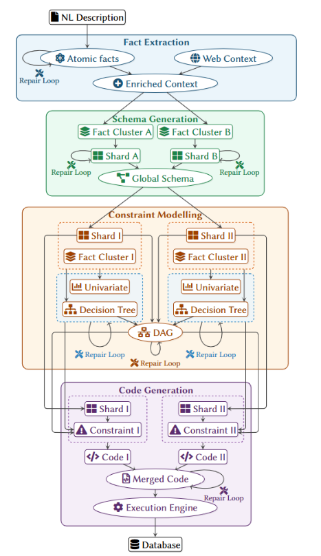

# Generating Databases from Natural Language Specification

> **Accepted at the [SynthAI '26 — Workshop on Synthetic Data Generation and Management for Building AI Systems](https://synthetic-data-sigmod.github.io/syndata2026/index.html)**
> Co-located with ACM SIGMOD 2026 · May 31–June 05, 2026 · Bengaluru, India

**Aviroop Mitra** — Indian Institute of Science, Bengaluru, India
**Anupam Sanghi** — IIT Hyderabad, Sangareddy, India

DOI: [10.1145/3814574.3816751](https://doi.org/10.1145/3814574.3816751) · ISBN: 979-8-4007-2581-4/2026/05

---

## Abstract

Synthetic databases are critical for application development, testing, benchmarking, and data engineering workflows. Existing database generators typically require formal specifications, significant technical expertise, or access to production datasets and workloads, making them unsuitable for rapid bootstrapping in greenfield settings. This makes them unsuitable for domain experts seeking rapid bootstrapping in greenfield design settings. To address this, we present ScribbleDB, an end-to-end agentic pipeline that converts natural language descriptions into database schemas and instantiated tables. The pipeline decomposes the task into four stages: fact extraction, schema generation, constraint modeling and code generation. The pipeline consists of four stages: fact extraction, schema generation, constraint modeling, and code generation. By combining LLM-based reasoning with deterministic validation and large-scale materialization, ScribbleDB avoids scalability bottlenecks in schema complexity and data size. Experiments show that ScribbleDB achieves nearly six-fold higher table accuracy and four-fold lower latency than prior work across multiple datasets, while preserving statistical realism and logical fidelity.

**CCS Concepts:** Information systems → Database design and models; Database utilities and tools.

**Keywords:** Database Generation; Schema Generation

---

## 1 Introduction

**Why Synthetic Databases Matter.**
Synthetic databases are essential for application development, testing, and benchmarking when access to real data is restricted due to privacy, legal, or organizational constraints. Developers require production-like datasets that reflect realistic scale, distributions, and correlations in order to validate application logic, analytics pipelines, and system performance.

**State of the Art and Its Limitations.**
Several database generators have been proposed in the literature [17]. These include (a) *Ab initio* generators (e.g., MUDD [21], PSDG [8], PDGF [15], Myriad [1]) that use declarative specifications, constraints, or data generation languages [4]; and (b) *Regeneration-based* approaches (e.g., DBSynth [14], RSGen [20], DScaler [30], TouchStone [26], Hydra [19], SAM [28]) that leverage statistical metadata [20, 18], cardinality constraints [2, 26], workload characteristics [19, 16, 28], or data distribution [5, 27, 7, 22] from an existing deployment. In both classes of generators, while existing tools are powerful, they presuppose either deep technical expertise or access to sensitive production artefacts, and impose substantial modeling and iteration overhead. As a result, there is no practical solution that allows a non-technical domain expert to quickly synthesize a realistic database solely from an informal natural language (NL) description of the target database, which is often desirable, especially in early-stage design settings.

**LLMs bring Opportunity and Challenges.**
LLMs have shown strong effectiveness in translating NL to structured artefacts, most notably for NL-to-SQL [29, 13]. There are also early efforts on text-to-schema generation [25]. This makes LLMs a compelling choice for database synthesis because they can interpret under-specified requirements and synthesize complex generation algorithms. However, building such a system entails the following core challenges:

*(a) Expressiveness.* Modeling rich domain constraints, such as complex inequalities, conditional logic, and cross-table dependencies, in the generation pipeline requires careful design.

*(b) Hallucination.* LLMs can invent spurious requirements or silently omit important ones [9]. In multi-step pipelines, these errors propagate, leading to misalignment with given requirements (e.g., dangling foreign keys or ignored logical constraints).

*(c) Scalability.* Both LLM context windows and materialization speed are finite bottlenecks. As relational schema grow in complexity, monolithic generation suffers from significant context degradation [12]. Further, direct LLM inference does not scale to materializing large datasets due to token-generation limits.

**ScribbleDB Database Generator.**
We present ScribbleDB, an end-to-end NL-to-database synthesis system, which enables rapid bootstrapping of realistic relational databases directly from informal textual specifications. To the best of our knowledge, it is the first framework that targets full database synthesis from NL. It addresses the above challenges through the following design decisions:

*(a) Ancestral-sampling.* To address the expressiveness challenge, the extracted constraints are compiled into a dependency graph and executable code is generated that samples column values in reverse-topological order, from derived columns to independent columns, using inverse-functions. By synthesizing local samplers that are valid-by-construction, all constraints are satisfied without post-hoc repair. Our experiments highlight that this approach could achieve a near-perfect decision-tree type constraint fidelity.

*(b) Context enrichment.* Technical terms and ambiguous domain logic are grounded using web-retrieved definitions and domain-specific knowledge bases, mitigating hallucinations. Our experiments showcase a 10% boost in Table F1 from context enrichment.

*(c) Sharding.* Schema extraction and constraint modeling are decomposed into sub-problems and assigned to independent agent instances. This enables accurate modeling of schema shards while reducing latency through parallel processing. For large-scale databases, sharding improves table accuracy by 30% and increases inference speed for schema generation by four times.

In conclusion, ScribbleDB shows promise of an agentic system which can handle arbitrary scales of data generation and large schema efficiently, while being in sync with user-given database requirements and handling ambiguous and incomplete descriptions.

---

## 2 System Architecture

ScribbleDB is a four-stage pipeline: *Fact Extraction*, *Schema Generation*, *Constraint Modeling*, and *Code Generation*, as shown in Figure 1. Each stage uses deterministic checks to prevent error accumulation; failures trigger a repair loop with the agent. The system assumes the NL input is internally consistent; it does not detect or resolve contradictions. We now discuss each stage with the help of the following example of a *Credit Risk (Loan Origination)* database.

> *Consider a retail bank's loan origination database. Applicants have a credit score (300–850), annual income and DTI ratio. Approved loans receive an Interest Rate derived from a tiered lookup of credit score and loan amount (e.g., if credit score > 750 and amount < $50K then rate = 3.5%). We additionally require the final Interest Rate across all loans to follow a Gaussian distribution. Also, the benefits of various credit limits need to be tracked.*

---

**Figure 1: ScribbleDB Architecture.** Fact extraction (§2.1) is followed by schema generation (§2.2). Subsequently, structured constraints are produced (§2.3), and finally code is synthesized to materialize the database (§2.4).

*Figure 1: ScribbleDB Architecture: Fact extraction (§2.1) is followed by schema generation (§2.2). Subsequently, structured constraints are produced (§2.3), and finally code is synthesized to materialize the database (§2.4).*

---

### 2.1 Fact Extraction

Given an NL description, ScribbleDB extracts *atomic facts* — short single-requirement statements (e.g., "An applicant has a credit score between 300 and 850"; "The overall interest rate follows a Gaussian distribution"). A *verifier agent* audits the set for omissions or hallucinations, iterating until the set is consistent. Technical terms are then *enriched* via web retrieval (e.g., defining *DTI* as Debt-to-Income ratio) to ground subsequent stages.

### 2.2 Schema Generation

The facts from Stage 1 are turned into a global schema using a *shard-and-merge* strategy.

**Shard.** An agent clusters atomic facts so that each cluster describes a closely related subset of tables and their schematic constraints. Each cluster is processed in parallel by *schema-architect agent* to produce a *schema shard*. Each shard undergoes deterministic validation, including PK-FK consistency and *connectivity* checks, ensuring no table is isolated in the schema graph.

**Merge.** Validated shards are merged into a global schema using a deterministic schema-alignment procedure. Since independently generated shards may contain overlapping representations of the same entity, overlaps are identified through stable matching (Gale–Shapley [6]) over tables using pairwise similarity scores. For a pair of tables from different shards, the similarity score combines: (i) semantic similarity between table names, and (ii) a column-alignment score. The column-alignment score is computed through a second stable-matching step over columns, where column pairs are matched based on semantic similarity. Finally, the highest-scoring stable table alignments are treated as entity overlaps and merged into the global schema.

### 2.3 Constraint Modeling

The goal here is to produce a structured representation of *logical* and *statistical constraints* and a *global generation order* of columns. First, the global schema graph is sharded into connected components. A union of facts related to each table in each component is taken to produce subproblems, each with a schema shard and a fact cluster.

**Structured Constraints.** A *constraint modelling agent* extracts *univariate distributions* (e.g., the target Gaussian for `interest_rate`) and *decision-tree logical constraints* (e.g., if `credit_score` > 750 and `loan_amount` < $50K then `interest_rate` = 3.5%) from each shard in parallel. Each constraint is stored in a nested structured format, which can be easily verified later. We support cross-table column dependency as well as aggregations (e.g., average, sum, max) in logical constraints. A *mathematics agent* verifies distributions; decision-tree feasibility is deterministically validated.

**Global Generation Order.** Using the FK links and decision tree constraints, a column-level dependency graph is constructed in a *reverse-causal* manner: the constrained outcome (`interest_rate`) is positioned as a root node to serve as an anchor for its independent drivers (`credit_score` and `loan_amount`). If cycles are detected, a *patch agent* generates patches to constraints to ensure the dependency graph is acyclic.

### 2.4 Code Generation

The goal here is to synthesize the database materialization program. First, for each schema-shard, a code is generated, which is then merged to produce the final consolidated code.

**Shard-level Code.** The shard-level code uses an *ancestral sampling* scheme. By following the reverse-causal order of the dependency graph, a *code generator agent* ensures constraints are satisfied by construction. For instance, the code samples the `interest_rate` and `loan_amount` first, and then uses a synthesized *inverse function* to sample the `credit_score` required to satisfy the pre-sampled rate and amount combination. This avoids post-hoc patching.

**Code Merge.** Shard-level code is deterministically merged during a final consolidation step. To ensure compatibility across independently generated shards, the agent must emit code using a fixed template: imports, seed definitions, helper functions, intermediate-table synthesis, and base-table materialization. When two code shards contain different initialization of the same schema component, we use a clear set of tie-breaking rules to decide which version to keep. For example, if a shard uses random initialization for a column while another uses a specific distribution, then the latter code snippet replaces the former. This guarantees a single, consistent implementation for every table, column, and generation routine. Finally, the merged program is smoke-tested at 10% scale; any failures trigger an agent retry loop before full materialization.

---

## 3 Experimental Evaluation

We evaluate the performance of the ScribbleDB framework across several dimensions: schema quality, data modeling accuracy, and system robustness through ablation studies. The implementation source code of ScribbleDB is available at [3].

### 3.1 Experimental Setup

**Datasets.** Following datasets have been used:

(a) *RSchema [25].* A suite of 381 test cases representing diverse real-world scenarios. Each test case contains an NL description and the corresponding relational schema.

(b) *Handcrafted datasets [3].* We introduce 135 test cases (NL description, schema, distributional and logical constraints) generated via *Claude 4.5 Sonnet*, spanning domains such as *Credit Risk*, *Quantitative Finance*, and *Clinical Trials*. Schema sizes range from 3 to 50 tables, with a 2:3:5 ratio across small (<10), medium (11–25), and large schemas (26+). Constraints scale linearly with schema size (avg. 11+) across 20+ distribution families (e.g., normal, Zipfian). Fact tables range from 10K to 1M rows.

(c) *Benchmark Datasets.* We used the official documentation of IMDB [10], TPC-H [23], TPC-DS [24], and MIMIC-IV [11] datasets, mined distributional constraints and converted these information using *Claude 4.5 Sonnet* into NL descriptions, available at [3]. Crucially, to evaluate robustness against ambiguity, these descriptions intentionally omit the benchmark names themselves, alongside specific schema details, data distributions, and explicit parameters.

**LLM API.** *OpenAI GPT-4o* has been used for all LLM components of the ScribbleDB pipeline.

**Baselines.** Schema quality has been compared against *SchemaAgent [25]*, an LLM-based system to solve the text-to-schema task.

**Evaluation Metrics.**

*Schema Quality.* The evaluation protocol from [25] is used for schema quality measurement against manually annotated ground-truth schemas. Specifically, F1 and exact-match accuracy (Acc) for tables, attributes (Attr), keys (PK), and data types (DT) are reported.

*Data Modeling Accuracy.* The fidelity of the generated data relative to the specified NL requirements is evaluated using two categories:

(a) *Univariate Distributions:* The *Mean Relative Error (MRE)* is measured over each parameter value of the generated distribution against the ground truth; a score close to 0 gives a better alignment. Further, *Normalized Log-likelihood (NLL)* of the generated column against the ground truth parameter values is calculated. Specifically, given generated values x₁, …, xₙ and ideal density function f(·), NLL is defined as:

$$\text{NLL} = \exp\!\left(\frac{1}{n}\sum_{i=1}^{n}\left[\log f(x_i) - \log f(x^{\star})\right]\right)$$

where x* denotes the maximum-density value under the ideal distribution. NLL values closer to 1 indicate better alignment with the target distribution. Also, the *Kolmogorov-Smirnov (KS) statistic* between the empirical CDF of the generated columns and the ideal CDFs is computed; a score near 0 indicates better alignment.

(b) *Logical Constraints:* For complex decision-tree-based constraints, the *Fraction of Agreement (FA)*, i.e., the proportion of generated rows that strictly adhere to the defined logic, is measured.

### 3.2 Performance Evaluation

**Schema Quality Evaluation.** ScribbleDB is compared against SchemaAgent to assess structural metrics. As can be seen from Table 1, ScribbleDB achieves a consistently high score across each individual metric across different datasets (e.g., 95–100 Table F1, 85–95 Attr F1). In contrast, the same is quite varied (e.g., 48–90 Table F1, 21–80 Attr F1) for SchemaAgent, which shows ScribbleDB's superiority on handling various types of NL description and schema. Moreover, SchemaAgent's result quality drops significantly for the Handcrafted and Benchmark datasets compared to RSchema (e.g., Attr F1 drops from 49 (RSchema) to 6 (Handcrafted)). This is due to the simplicity of RSchema, where the NL descriptions are straightforward and deal with small schemas (≤5 tables). In contrast, the other two datasets present more realistic challenges by introducing larger schemas along with missing information and ambiguous descriptions. As discussed earlier, ScribbleDB uses context enrichment and schema sharding to counteract these.

**Table 1: Schema Quality Comparison — ScribbleDB achieves high-quality and significantly outperforms SchemaAgent**

| Dataset / System | Table F1 | Table Acc | Attr F1 | Attr Acc | PK Acc | DT Acc |
|:---|:---:|:---:|:---:|:---:|:---:|:---:|
| **RSchema** | | | | | | |
| SchemaAgent | 90 | 65 | 80 | 49 | 73 | 84 |
| ScribbleDB | **100** | **100** | **95** | **80** | **100** | **95** |
| **Handcrafted** | | | | | | |
| SchemaAgent | 48 | 14 | 47 | 6 | 39 | 15 |
| ScribbleDB | **95** | **86** | **91** | **80** | **100** | **95** |
| **Benchmark** | | | | | | |
| SchemaAgent | 52 | 32 | 21 | 10 | 80 | 70 |
| ScribbleDB | **97** | **90** | **85** | **75** | **100** | **97** |

**Data Modeling Quality Evaluation.** The statistical fidelity of ScribbleDB is evaluated for Handcrafted and Benchmark datasets (Table 2). For univariate distribution metrics, we incorporate schema mismatches: validation scores are computed over non-key numeric columns within the overlap of the ground-truth and generated schema, scaled by the schema recall fraction to penalize structural omissions. Even with this penalty, ScribbleDB maintains high statistical realism (e.g., KS < 0.3, MRE < 0.2, NLL > 0.7) across all the datasets. To improve the scores further, precise parameter estimation for complex distributions remains a target for future work. Additionally, the table also reports the logical fidelity for the Handcrafted Dataset (for complexity and lack of reliability, we have not mined logical constraints from the Benchmark dataset). ScribbleDB achieves an FA of 1.0 for decision-tree constraints, validating that the sampling order enforced by the dependency graph perfectly satisfies logical prerequisites by construction.

**Table 2: Data Modeling Quality — ScribbleDB achieves high logical fidelity and statistical realism**

| Dataset | MRE ↓ | NLL ↑ | KS ↓ | FA ↑ |
|:---|:---:|:---:|:---:|:---:|
| **Handcrafted Dataset** | 0.18 | 0.72 | 0.29 | **1.00** |
| **Benchmark Datasets** | | | | |
| TPC-H | 0.12 | 0.82 | 0.15 | — |
| TPC-DS | 0.15 | 0.81 | 0.14 | — |
| IMDB | 0.13 | 0.75 | 0.10 | — |
| MIMIC-IV | 0.20 | 0.73 | 0.22 | — |

**Ablation Studies.** We evaluate the contribution of three key architectural components, shard-and-merge, context enrichment, and ancestral sampling, to overall system performance (Table 3) on Handcrafted dataset. Schema sharding improves both schema quality (e.g., Table Acc: 63→86) and data modeling accuracy (e.g., FA: 0.84→1.00, MRE: 0.18→0.38, NLL: 0.72→0.52). This shows that *sharding* helps parallel agents to model smaller, focused schema portions better. Context enrichment improves Table Accuracy by over 30% and prevents the degradation of distribution metrics by addressing missing information and ambiguity (e.g., incomplete schema description, missing distribution parameters). This increases the schema recall fraction and improves the parameter value estimations, which in turn improves the result quality. But the logical constraints are derived from the description itself, so context enrichment has no effect on FA. Finally, ancestral sampling is essential for logical consistency, increasing FA from 0.79 to 1.0. Consistent with its design to exclusively materialize logical constraints, it does not affect univariate metrics.

**Table 3: Ablation Study — Sharding and context enrichment drive major gains in schema and data distribution quality; ancestral sampling uniquely guarantees logical consistency**

| Configuration | Table F1 | Table Acc | Attr F1 | Attr Acc | PK Acc | DT Acc | MRE | NLL | KS | FA |
|:---|:---:|:---:|:---:|:---:|:---:|:---:|:---:|:---:|:---:|:---:|
| ScribbleDB (Full) | **95** | **86** | **91** | **80** | **100** | **95** | **0.18** | **0.72** | **0.29** | **1.00** |
| w/o Enrichment | 85 | 63 | 83 | 72 | 95 | 88 | 0.34 | 0.55 | 0.31 | 1.00 |
| w/o Sharding | 74 | 56 | 65 | 42 | 92 | 80 | 0.38 | 0.52 | 0.34 | 0.84 |
| w/o Ancestral Sampling | — | — | — | — | — | — | 0.18 | 0.72 | 0.29 | 0.79 |

**Cost and Efficiency Analysis.** Table 4 details token consumption and time taken for schema generation and end-to-end inference latency per tuple in the database. RSchema dataset only contains schema instances, not the materialized databases; also, SchemaAgent only converts NL to schema and applies a *group-chat interaction* (not retry loops). Therefore, the corresponding cells of Table 4 are empty. ScribbleDB achieves a speedup of 3–4 times in comparison to SchemaAgent in schema generation on the Handcrafted and Benchmark datasets due to its shard-and-merge parallelization. In the case of RSchema, the times are comparable due to the inability to leverage a sharding strategy, since the schemas are very small (≤5 tables). We also see that although iterative repair loops generally increase token usage, ScribbleDB remains more token-efficient on complex scenarios (e.g., Handcrafted dataset) with strictly lower latency. Also, the Handcrafted dataset's higher retry count highlights the need for self-correction on complex structures. Crucially, all configurations complete well within our five-retry limit, ensuring the repair mechanism enhances quality without becoming a computational bottleneck.

**Table 4: Efficiency and Cost Comparison (Average per test-case) — ScribbleDB achieves up to a 3–4× schema generation speedup via parallelization, maintains low end-to-end latency despite the token overhead of self-correction**

| Dataset / System | Schema Gen. Tokens | Schema Gen. Time | Avg. Row Gen. Time | Avg. Retry Loops |
|:---|:---:|:---:|:---:|:---:|
| **RSchema** | | | | |
| SchemaAgent | 123K | 140s | — | — |
| ScribbleDB | 253K | 145s | — | 2.3 |
| **Handcrafted** | | | | |
| SchemaAgent | 465K | 640s | — | — |
| ScribbleDB | 352K | **163s** | 30ms | 3.0 |
| **Benchmark** | | | | |
| SchemaAgent | 231K | 720s | — | — |
| ScribbleDB | 289K | **190s** | 10ms | 1.7 |

---

## 4 Conclusion

ScribbleDB demonstrates strong efficacy in handling expressiveness, reducing hallucination, and scaling to complex database scenarios. In the future, we aim to extend our constraint engine to support more nuanced data relationships. Further, building on top of current ancestral-sampling scheme, we propose incorporating multivariate distributions via copulas to capture subtle, high-dimensional cross-column correlations that simple univariate priors cannot model.

---

## Acknowledgments

We thank Jayant Haritsa for his valuable feedback, Carsten Binnig for discussions that inspired the problem, and Nitthesh D and Udit Senapaty for their support in this work.

---

## References

[1] Alexander Alexandrov, Kostas Tzoumas, and Volker Markl. 2012. Myriad: scalable and expressive data generation. *Proc. VLDB Endow.* 5, 12 (2012), 1890–1893. doi:10.14778/2367502.2367530

[2] Arvind Arasu, Raghav Kaushik, and Jian Li. 2011. Data generation using declarative constraints. In *Proceedings of the 2011 ACM SIGMOD Intl. Conference on Management of Data (SIGMOD '11)*. 685–696. doi:10.1145/1989323.1989395

[3] Aviroop. 2026. Autonomous-Data-Architect. https://github.com/Aviroop07/Autonomous-Data-Architect. GitHub repository.

[4] Nicolas Bruno and Surajit Chaudhuri. 2005. Flexible database generators. In *Proceedings of the 31st Intl. Conference on Very Large Data Bases (VLDB '05)*. 1097–1107.

[5] Haipeng Chen, Sushil Jajodia, Jing Liu, Noseong Park, Vadim Sokolov, and V. S. Subrahmanian. 2019. FakeTables: Using GANs to Generate Functional Dependency Preserving Tables with Bounded Real Data. In *Proceedings of the Twenty-Eighth Intl. Joint Conference on Artificial Intelligence (IJCAI '19)*. 2074–2080. doi:10.24963/ijcai.2019/287

[6] D. Gale and L. S. Shapley. 1962. College Admissions and the Stability of Marriage. *The American Mathematical Monthly* 69, 1 (1962), 9–15. doi:10.1080/00029890.1962.11989827

[7] Lovedeep Gondara and Ke Wang. 2018. MIDA: Multiple Imputation using Denoising Autoencoders. arXiv:1705.02737 [cs.LG]

[8] Joseph E. Hoag and Craig W. Thompson. 2007. A parallel general-purpose synthetic data generator. *SIGMOD Rec.* 36, 1 (2007), 19–24. doi:10.1145/1276301.1276305

[9] Lei Huang, Weijiang Yu, Weitao Ma, Weihong Zhong, Zhangyin Feng, Haotian Wang, Qianglong Chen, Weihua Peng, Xiaocheng Feng, Bing Qin, and Ting Liu. 2025. A Survey on Hallucination in Large Language Models: Principles, Taxonomy, Challenges, and Open Questions. *ACM Trans. Inf. Syst.* 43, 2, Article 42 (2025), 55 pages. doi:10.1145/3703155

[10] IMDb. 2024. IMDb Non-Commercial Datasets. https://datasets.imdbws.com. Accessed: 2026-05-08.

[11] Alistair Johnson, Lucas Bulgarelli, Tom Pollard, Brian Gow, Benjamin Moody, Steven Horng, Leo Anthony Celi, and Roger Mark. 2024. MIMIC-IV. PhysioNet (2024). doi:10.13026/kpb9-mt58. Version 3.1.

[12] Nelson F. Liu, Kevin Lin, John Hewitt, Ashwin Paranjape, Michele Bevilacqua, Fabio Petroni, and Percy Liang. 2023. Lost in the Middle: How Language Models Use Long Contexts. arXiv:2307.03172 [cs.CL]

[13] Yuyu Luo, Guoliang Li, Ju Fan, Chengliang Chai, and Nan Tang. 2025. Natural Language to SQL: State of the Art and Open Problems. *Proc. VLDB Endow.* 18, 12 (2025), 5466–5471. doi:10.14778/3750601.3750696

[14] Tilmann Rabl, Manuel Danisch, Michael Frank, Sebastian Schindler, and Hans-Arno Jacobsen. 2015. Just can't get enough: Synthesizing Big Data. In *Proceedings of the 2015 ACM SIGMOD Intl. Conference on Management of Data (SIGMOD '15)*. 1457–1462. doi:10.1145/2723372.2735378

[15] Tilmann Rabl, Michael Frank, Hatem Mousselly Sergieh, and Harald Kosch. 2010. A data generator for cloud-scale benchmarking. In *Proceedings of the Second TPC Technology Conference on Performance Evaluation, Measurement and Characterization of Complex Systems (TPCTC'10)*. 41–56.

[16] Anupam Sanghi, Shadab Ahmed, and Jayant R. Haritsa. 2022. Projection-compliant database generation. *Proc. VLDB Endow.* 15, 5 (2022), 998–1010. doi:10.14778/3510397.3510398

[17] Anupam Sanghi and Jayant R. Haritsa. 2023. Synthetic Data Generation for Enterprise DBMS. In *2023 IEEE 39th Intl. Conference on Data Engineering (ICDE '23)*. 3585–3588. doi:10.1109/ICDE55515.2023.00274

[18] Anupam Sanghi, Rajkumar Santhanam, and Jayant R. Haritsa. 2021. Towards Generating HiFi Databases. In *Database Systems for Advanced Applications: 26th Intl. Conference (DASFAA '21)*. 105–112. doi:10.1007/978-3-030-73194-6_8

[19] Anupam Sanghi, Raghav Sood, Jayant R. Haritsa, and Srikanta Tirthapura. 2018. Scalable and Dynamic Regeneration of Big Data Volumes. In *Proceedings of the 21st Intl. Conference on Extending Database Technology (EDBT '18)*. 301–312. doi:10.5441/002/EDBT.2018.27

[20] Entong Shen and Lyublena Antova. 2013. Reversing statistics for scalable test databases generation. In *Proceedings of the Sixth Intl. Workshop on Testing Database Systems (DBTest '13)*. Article 7, 6 pages. doi:10.1145/2479440.2479445

[21] John M. Stephens and Meikel Poess. 2004. MUDD: a multi-dimensional data generator. In *Proceedings of the 4th Intl. Workshop on Software and Performance (WOSP '04)*. 104–109. doi:10.1145/974044.974060

[22] Saravanan Thirumuruganathan, Shohedul Hasan, Nick Koudas, and Gautam Das. 2020. Approximate Query Processing for Data Exploration using Deep Generative Models. In *2020 IEEE 36th Intl. Conference on Data Engineering (ICDE '20)*. 1309–1320. doi:10.1109/ICDE48307.2020.00117

[23] Transaction Processing Performance Council. 2022. TPC Benchmark™ H Standard Specification. https://www.tpc.org/tpch/. Version 3.0.1.

[24] Transaction Processing Performance Council. 2024. TPC Benchmark™ DS Standard Specification. https://www.tpc.org/tpcds/. Version 4.0.0.

[25] Qin Wang, Youhuan Li, Yansong Feng, Si Chen, Ziming Li, Pan Zhang, Zihui Si, Yixuan Chen, Zhichao Shi, Zebin Huang, Guo Chen, and Wenqiang Jin. 2025. Text2Schema: Filling the Gap in Designing Database Table Structures based on Natural Language. arXiv:2503.23886 [cs.DB]

[26] Qingshuai Wang, Yuming Li, Rong Zhang, Ke Shu, Zhenjie Zhang, and Aoying Zhou. 2023. A Scalable Query-Aware Enormous Database Generator for Database Evaluation. *IEEE Transactions on Knowledge and Data Engineering* 35, 5 (2023), 4395–4410. doi:10.1109/TKDE.2022.3153651

[27] Lei Xu, Maria Skoularidou, Alfredo Cuesta-Infante, and Kalyan Veeramachaneni. 2019. Modeling tabular data using conditional GAN. In *Proceedings of the 33rd Intl. Conference on Neural Information Processing Systems (NeurIPS '19)*. Article 659, 11 pages.

[28] Jingyi Yang, Peizhi Wu, Gao Cong, Tieying Zhang, and Xiao He. 2022. SAM: Database Generation from Query Workloads with Supervised Autoregressive Models. In *Proceedings of the 2022 Intl. Conference on Management of Data (SIGMOD '22)*. 1542–1555. doi:10.1145/3514221.3526168

[29] Tao Yu, Rui Zhang, Kai Yang, Michihiro Yasunaga, Dongxu Wang, Zifan Li, James Ma, Irene Li, Qingning Yao, Shanelle Roman, Zilin Zhang, and Dragomir Radev. 2019. Spider: A Large-Scale Human-Labeled Dataset for Complex and Cross-Domain Semantic Parsing and Text-to-SQL Task. arXiv:1809.08887 [cs.CL]

[30] J. W. Zhang and Y. C. Tay. 2016. Dscaler: synthetically scaling a given relational database. *Proc. VLDB Endow.* 9, 14 (2016), 1671–1682. doi:10.14778/3007328.3007333
